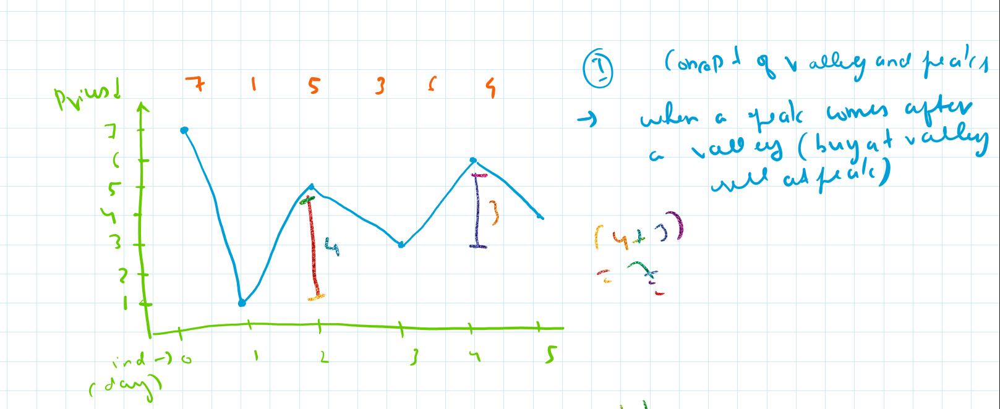
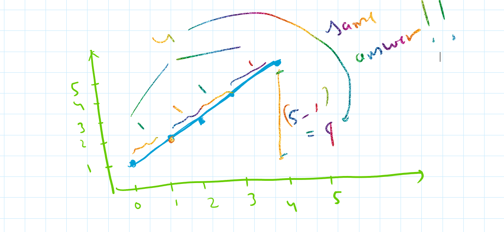

🔹 Problem Description

You are given an integer array prices where prices[i] is the price of a stock on the i-th day.  
You may complete as many transactions as you like (buy one and sell one share of the stock multiple times), but you must sell the stock before you buy again.  
Return the maximum profit you can achieve.  

💡 Optimal Solution Explanation  

The key difference from LeetCode 121 is that now multiple transactions are allowed.    
So whenever the price goes up from one day to the next, we can treat it as if we bought the stock yesterday and sold it today.  
If prices[i] > prices[i-1], add (prices[i] - prices[i-1]) to profit.  
If the price drops, do nothing (skip that day).  
This way, we capture all upward movements in the stock chart, which is equivalent to buying at every valley and selling at every peak.  

⏱️ Complexity Analysis  

Time Complexity: O(n) (one pass through prices).  
Space Complexity: O(1) (only one variable to track profit).  

NOTE: Please refer to the images to visualise this graphically. The second image shows instead of finding valley and peak (actual), it shows that the growth at each point contributes to profit.  

Here are the graphs:  

  

  

HAPPY SOLVING!!
