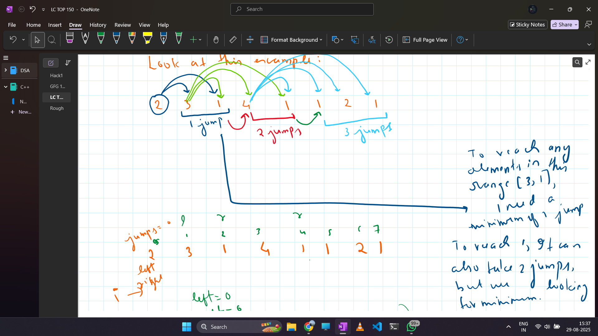

🔹 Problem Statement  

You are given an integer array nums where each element represents the maximum jump length from that position.  
Return the minimum number of jumps required to reach the last index.  

Input: nums = [2,3,1,1,4]  
Output: 2 (Jump 1 → 2, then 2 → 4)

Input: nums = [2,3,0,1,4]  
Output: 2 (Jump 1 → 1, then 1 → 4)  

🔹 Intuition / Approach for Optimal Solution  

This problem can also be solved greedily using a level-based traversal:  
Keep track of the current range of indices reachable with the current number of jumps (left to right).  
For each position within this range, calculate the farthest index we can reach in the next jump.  
Once we finish the current range, we jump → update left and right to the next range.  
Repeat until the right reaches or exceeds the last index.  

Key idea:  

Each jump covers a “level” of reachable indices.  
Within that level, we pick the farthest point we can go → minimizes jumps.  

Refer to the image below:  
  

🔹 Complexity Analysis  

Time Complexity: O(n)  
Each index is visited exactly once in the inner loop across all levels.  

Space Complexity: O(1)  
Only a few integer variables used, no extra array needed.  

HAPPY SOLVING!!
